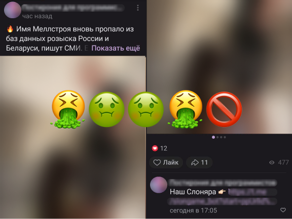
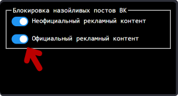

&nbsp;

  <picture>
    
  </picture>

<h3 align="center">Надоели назойливые посты в ленте?</h3>

  Надоели назойливые посты в ленте ВК? Эпотажные аморальные посты с блогерами или посты со ссылкой в источник, реклама рулеток и казино? 

  Даже установив продвинутый блокировщик вроде <a src="https://github.com/AdguardTeam/AdguardBrowserExtension?tab=readme-ov-file">Adguard</a> , мы все равно встречаем идиотские посты вроде таких:

  

 
<strong>Расширение</strong> уберет эти отвратительные посты

> Расширение не собирает никаких данных о пользователях, весь код открытый и представлен тут.  
> Расширение некоммерческое и юзается бесплатно, изначально писал для личного использования.

### Маленькая фича - Убрать назойливые рекламные посты
По желанию можете также убрать рекламные посты от вк, ибо с каждым годом в ленте их становится больше

Для этого включите переключатель `Официальный рекламный контент`:

  

##  Браузеры

| Browser                     | Supports |
|---------------------------- |:-------:|
| Chromium-based browsers     | ✔️      |
| Firefox                     | ❌      |
| Firefox Mobile              | ❌     |
| Opera                       | ❌      |
| Edge                        | ❌      |